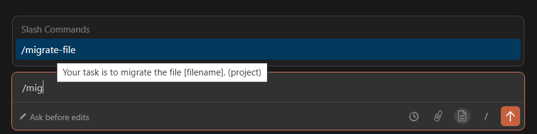
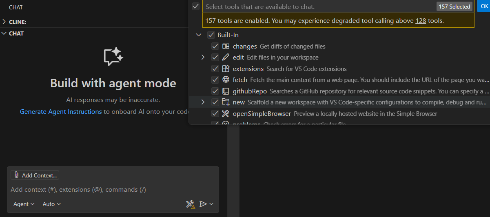

# TASK 1: Multi-File Legacy Migration (75 min)

Transform legacy codebase using your AI coding tool (Cursor, Claude Code, Copilot, etc.) in 3 phases:

## 🔒 PART A: Project Overview + Security Audit (15 min)

### Step 1: Explore Codebase

**Goal:** Understand the TaskFlow API structure and functionality.

**Instructions:**

Open your AI tool and use AI to help you understand the code. Prompt:

```
Explore this codebase and explain:
- What does this application do?
- What are the main components (models, services, routes)?
- What database does it use?
- What endpoints are available?
```

✅ Success Criteria:

- [ ] You understand what the TaskFlow API does
- [ ] You know system architecture and files to migrate (models, services, routes)

### Step 2: Security audit

**Goal:** Identify security vulnerabilities in the legacy codebase.
In the code, you can find a file with secrets: `python/secrets.txt` or `nodejs/secrets.txt`
The secrets are not guarded. LLM can access them.

#### 2.1. Perform verification test:

- Ask AI: `What is database password?` or `What is my JIRA_TOKEN?`
- AI should be able to provide you with it.

#### 2.2. Secure sensitive files from AI Access

1. Choose your AI tool and follow steps:

<details>
<summary><strong>Claude code</strong></summary>

1. Create `.claude/settings.json` in project root

2. Add to the `permissions.deny` array:
   ```json
   {
     "permissions": {
       "deny": ["Read(*/secrets.txt)"]
     }
   }
   ```
3. Save the file
4. **Restart Claude Code**
</details>

<details>
<summary><strong>Cursor / Github Copilot / Windsurf / Cline</strong></summary>
1. Open or create ignore file in project root:

- Cursor: .cursorignore
- Copilot: .gitignore
- Windsurf: .windsurfignore
- .clineignore

2. Add pattern:

   ```
   */secrets.txt
   ```

3. Save the file
4. **Restart the tool**
</details>

### 2.3 Verify AI can no longer access secrets

Ask your AI again: `What is database password?` or `What is my JIRA_TOKEN?`
Expected behaviour:

1. AI tool looks for config, secrets, .env files
2. It finds no results in codebase
3. Expected response: `I couldn’t find any database password/JIRA_TOKEN in this workspace.` or similar

If AI still shows the password, see TROUBLESHOOTING.md → `AI Can Still Access Secret Files`

✅ Success Criteria:

- [ ] You configured your AI tool to ignore sensitive files
- [ ] AI can NO LONGER tell you the database password or JIRA token

---

## 🧠 PART B: Create Migration Plan (20 min)

**Goal:** Create a detailed, actionable plan for migrating the legacy codebase to modern standards.

### Step 1: Review coding standards

Before planning, understand what "modern" means:

1. Open your rule file (previous file `CODING_STANDARDS.md`)
2. Review the before/after examples for your chosen language
3. Note the key patterns you'll need to apply

**Key changes to implement in next steps:**

- **Python:** Flask → FastAPI, dicts → Pydantic, sync → async
- **Node.js:** JS → TypeScript, callbacks → async/await, no validation → Zod

### Step 2: Generate Migration Plan

#### 2.1. Switch your AI tool to Plan/Ask mode

#### 2.2. Prompt your AI to generate migration plan:

```
I need to migrate this legacy codebase to modern standards following your rules.

Create a detailed migration plan that includes:

1. **Files Inventory:** List ALL files that need changes in src/ directory
2. **Migration Order:** Define the sequence
3. **Changes Per File:** For each file, describe:
   - What legacy patterns exist (e.g., SQL injection, no types)
   - What modern patterns to apply (e.g., Pydantic models, parameterized queries)
   - Estimated complexity (Low/Medium/High)
4. **Breaking Changes:** Warn about changes that might break things
5. **Testing Strategy:** How to verify each migration works

Format as a structured plan with clear sections.
```

**Expected Output:** A detailed plan with 8 files to migrate.

### Step 3: Review and Validate Plan

1. Does the migration order make sense? (Models before services before routes?)
2. Should you adjust anything?

**Validation checklist:**

- [ ] Models are migrated before services
- [ ] Services are migrated before routes
- [ ] Database file (db.py/db.js) is included
- [ ] Plan mentions fixing SQL injection
- [ ] Plan mentions adding validation
- [ ] Plan mentions converting to async
- [ ] Plan includes testing after each file

### Step 4: Save plan as file

#### 4.1. Switch to Edit or Agent mode

#### 4.2. Prompt AI tools:

```
Save this migration plan to a file called MIGRATION_PLAN.md.

Format it as a checklist where I can track progress:

## Migration Plan

### Phase 1: Models
- [ ] Migrate models/user.py - Add Pydantic models, fix SQL injection
- [ ] Migrate models/task.py - Add Pydantic models, fix SQL injection
- [ ] Run tests: pytest rewritten/tests/test_users.py rewritten/tests/test_tasks.py

[Continue for all phases...]

Add a "Status" section at the top to track overall progress.
```

**Verification:**

- [ ] File `MIGRATION_PLAN.md` exists
- [ ] Contains checklist items for each file
- [ ] Has clear migration order
- [ ] Includes testing checkpoints

### ✅ Success Criteria for PART B

Before moving to PART C, verify:

- [ ] You created a detailed migration plan for all legacy files
- [ ] Plan follows correct order: models → services → routes
- [ ] Plan is saved to MIGRATION_PLAN.md file
- [ ] Each file has clear description of changes needed
- [ ] Plan includes testing checkpoints

**Next:** Proceed to PART C to execute the migration!

---

## ⚙️ PART C: Execute multi-file migration (40 min)

**Goal:** Migrate legacy files to modern standards using AI assistance and automation.

### Step 1: Manual migration - first file

Let's migrate one file manually to understand the process.

**Prompt your AI (Edit/Agent mode):**

```
Your task is to migrate the file @src/models/users.py (or @src/models/users.js) to modern standards.
Follow the steps:
1. Create new file in `rewritten` directory and rewrite the file:
   - Fix SQL injection (parameterized queries)
   - Add type hints/validation
   - Convert to async/await
2. Update tests in tests/ directory
3. Show me changes for confirmation
4. After approval, write files
5. Update MIGRATION_PLAN.md checklist

Ask clarifying questions if needed.

Don't migrate other files yet - just this one file.
```

**Review the proposed changes:**

- [ ] AI should automatically follow modern practices from rule file
- [ ] SQL queries use `?` placeholders, not f-strings/concatenation
- [ ] Functions have type hints (Python) or type annotations (TypeScript)
- [ ] Validation models exist (Pydantic/Zod)
- [ ] Code is async
- [ ] Tests are updated
- [ ] MIGRATION_PLAN.md is updated

**If it looks good, approve the changes.**

**Run tests:**

```bash
# Python
pytest rewritten/tests/test_users.py

# Node.js
npm test -- rewritten/tests/users.test
```

**Expected:** Tests make sense and pass! ✅
**If not:** Ask LLM to fix errors

### Step 2: Create reusable migration command

Now let's automate this process for the remaining files. 

#### 1. Create command file

- Claude code: `.claude/commands/migrate-file.md`
- Cursor: `.cursor/commands/migrate-file.md`
- Cline: `.clinerules/workflows/migrate-file.md`
- GitHub Copilot - Copilot doesn't have custom commands, but you can save the prompt as a new file and copy-paste its content to the chat window.

#### 2. Copy-paste the content to the file

```
Your task is to migrate the [filename] to modern standards.
Follow the steps:
1. Create new file in `rewritten` directory and rewrite the file:
   - Fix SQL injection (parameterized queries)
   - Add type hints/validation
   - Convert to async/await
2. Update tests in tests/ directory
3. Show me changes for confirmation
4. After approval, write files
5. Run tests. If tests fail, fix them.
6. Update MIGRATION_PLAN.md checklist

Ask clarifying questions if needed.

Don't migrate other files yet - just this one file.
```

#### 3. Save the file. If you use Cline, restart your IDE.

#### 4. Migrate next file

   <details>
   <summary><strong>Github Copilot</strong></summary>
   If using GitHub Copilot, copy file content, replace [filename] with the next file name and paste it to the chat window.
   </details>

   <details>
   <summary><strong>Cursor / Claude code / Cline</strong></summary>
   
   #### 4.1. Test command visibility
   In chat window start typing `/mig` - the command (or workflow in case of Cline) should be visible.





#### 4.2. Migrate the next file with command

```
/migrate-file src/models/task.py
```

OR

```
/migrate-file src/models/task.js
```

   </details>

#### 5. Verify it works through the full workflow and manually check off items in `MIGRATION_PLAN.md`

**Why command?**
In real world you probably won't create a command for such a small task, which can be finished in one hour. But imagine a more probable scenario:
- You have quite a large number of files to refactor,
- Your whole team works on rewriting,
- You can't complete the task within a few days and need to go back to your prompt.
In such case commands/workflows can be real time-savers.


### Step 3: Create formatting hook [Claude code & Cursor only]

**Goal:** AI automatically formats files after editing.

<details>
<summary><strong>Claude Code</strong></summary>
1. Create file `.claude/settings.json`
2. Paste following content:
   ```
   {
     "hooks": {
        "PostToolUse": [
           {
             "matcher": "Edit",
             "hooks": [
               {
                 "type": "command",
                 "command": "black ."
               },
               {
                 "type": "command",
                 "command": "isort ."
               },
             ]
           }
         ],
         "PreToolUse": [
           {
             "matcher": "Bash",
             "hooks": [
               {
                 "type": "command",
                 "command": "./hooks/block-rm.sh"
               }
             ]
           }
         ]
       }
     }
   ```

   
   ```
   "enableAllProjectMcpServers": true,
   "hooks": {
      "PostToolUse": [
         {
            "matcher": "Edit",
            "hooks": [
               {
                  "type": "command",
                  "command": "black ."
               },
               {
                  "type": "command",
                  "command": "isort ."
               }
            ]
         }
      ],
      "PreToolUse": [
         {
            "matcher": "Bash",
            "hooks": [
               {
                  "type": "command",
                  "command": "./hooks/block-rm.sh"
               },
            ]
      ]
   }
   ```
</details>

<details>
<summary><strong>Cursor</strong></summary>

1. Create file `.cursor/hooks.json` inside your **user directory** (`C:/Users/username/.cursor` or `~/.cursor`)
2. Paste following content:
   ```
   {
     "version": 1,
     "hooks": {
        "afterFileEdit": [
           {
           "command": "black ."
           },
           {
           "command": "isort ."
           }
        ],
        "beforeShellExecution": [
           {
              "command": "./hooks/block-rm.sh"
           }
        ]
     }
   }
   ```
</details>

3. Create `hooks` directory in the same place as `hooks.json` file. Move script `block-rm.sh` there
4. Restart your IDE
5. Now each time when the model creates or updates a Python file, it will be automatically formatted. Also, when the agent tries to run commands: `rm`, `del` or `Remove-Item`, the operation will be blocked.


*Note: Hooks are new features. Skip this step if you encounter issues*

### Step 4: Push changes to new branch with Github MCP Server

**1. Generate Github Personal Access Token**

Follow the [instruction](https://docs.github.com/en/authentication/keeping-your-account-and-data-secure/managing-your-personal-access-tokens#creating-a-fine-grained-personal-access-token) to generate your PAT.

**2. Create MCP Server for your tool**

   <details>
   <summary><strong>Cursor</strong></summary>

1.  Open "Cursor Settings"
2.  Navigate to "Tools & MCP"
3.  Click "New MCP Server". It will open `mcp.json` file
4.  Add new mcp server. Replace <YOUR_GITHUB_TOKEN> with generated token:
    ```
    {
       "mcpServers": {
          "github": {
             "type": "http",
             "url": "https://api.githubcopilot.com/mcp/",
             "headers": {
             "Authorization": "Bearer <YOUR_GITHUB_TOKEN>"
             }
          }
       }
    }
    ```
5.  When you return to Cursor Settings you should see an active GitHub MCP

   </details>

   <details>
   <summary><strong>Claude Code</strong></summary>

1. Add following line to `.claude/settings.json`: `"enableAllProjectMcpServers": true`
2. Create file `.mcp.json` in project root
3.  Copy-paste the content. Replace <YOUR_GITHUB_TOKEN> with generated token:
    ```
    {
       "mcpServers": {
          "github": {
             "type": "http",
             "url": "https://api.githubcopilot.com/mcp/",
             "headers": {
             "Authorization": "Bearer <YOUR_GITHUB_TOKEN>"
             }
          }
       }
    }
    ```
4.  Restart terminal / your IDE
5.  In Claude Code run command `/mcp`. You should see the following output:

   </details>

   <details>
   <summary><strong>GitHub Copilot - VSCode</strong></summary>
   
   1. Create `.vscode/mcp.json` file 
   2. Copy-paste the content. Replace <YOUR_GITHUB_TOKEN> with generated token:
      ```
      {
         "servers": {
            "github": {
               "type": "http",
               "url": "https://api.githubcopilot.com/mcp/",
               "headers": {
               "Authorization": "Bearer <YOUR_GITHUB_TOKEN>"
               }
            }
         }
      }
      ```
   3. Click "Start" text


4.  In case of problems see documentation: https://code.visualstudio.com/docs/copilot/customization/mcp-servers
</details>

**3. Prompt AI tool to generate new branch and commit changes**

Example prompt:

```
Create new commit and push to branch <BRANCH_NAME>
```

**4. Go to the GitHub page and verify if the new branch was created**

### Step 5: Continue migrating remaining files (Optional)

Migrate the remaining files if you have free time.

---

### ✅ Success Criteria for PART C

Before moving to TASK 2, verify:

- [ ] All tests passing: `pytest tests/` or `npm test`
- [ ] Rewritten code follows good practices (rule file)
- [ ] Rewritten files checked off in MIGRATION_PLAN.md
- [ ] Created `/migrate-file` command (or equivalent workflow)
- [ ] [Optional] Created automation hook
- [ ] Github MCP is working
- [ ] New branch created

**🎉 Migration complete!**

**Next:** Proceed to TASK 2 to build a new feature!

---

# TASK 2: Build a New Feature with AI (45 min)

**Goal:** Design and implement a new endpoint using AI assistance, applying everything you learned in TASK 1.

## Endpoint Specification

**Endpoint:** `GET /tasks/overdue`

**Description:** Returns all tasks that are past their due date and not completed.

**Query Parameters:**

- `days` (optional, integer, default: 0)
  - Filter tasks overdue by at least this many days
  - Example: `days=5` returns tasks overdue by 5+ days
- `limit` (optional, integer, default: 10, max: 100)
  - Maximum number of results to return
- `offset` (optional, integer, default: 0)
  - Pagination offset

**Business Logic:**

- Task is overdue if: `due_date < current_date` AND `status != 'completed'`
- If `days` is specified: `due_date < current_date - days`
- Sort by `due_date` ascending (most overdue first)
- Calculate `days_overdue` for each task

**Response Format (200 OK):**

```json
{
  "tasks": [
    {
      "id": 5,
      "title": "Setup CI/CD pipeline",
      "description": "Configure GitHub Actions",
      "status": "pending",
      "priority": "high",
      "due_date": "2025-10-10T14:00:00",
      "days_overdue": 14,
      "assigned_to": 2,
      "created_at": "2025-10-01T10:00:00",
      "updated_at": "2025-10-01T10:00:00"
    }
  ],
  "total": 1,
  "limit": 10,
  "offset": 0
}
```

**Response (400 Bad Request):**

```json
{
  "detail": "Invalid query parameter: days must be a non-negative integer"
}
```

**Response (500 Internal Server Error):**

```json
{
  "detail": "Internal server error"
}
```

---

## Step 1: Design the endpoint (10 min)

### 1.1. Create Specification Document

**Prompt your AI tool (in plan mode):**

```
I need to implement a new endpoint: GET /tasks/overdue

Based on the following requirements, create a detailed technical specification:

Requirements:
- Returns tasks where due_date < now() AND status != 'completed'
- Query params: days (int, default 0), limit (int, default 10, max 100), offset (int, default 0)
- If days specified: due_date < now() - days
- Sort by due_date ascending
- Calculate days_overdue for each task
- Response includes: tasks array, total count, limit, offset

Create a specification document that includes:
1. Endpoint details (method, path, description)
2. Query parameter validation rules
3. SQL query logic needed
4. Response schema
5. Error cases (400, 404, 500)
6. Test cases to implement
```

### 1.2. Review the plan

**Checklist:**

- [ ] Clear query parameter types and defaults
- [ ] Business logic explained
- [ ] Response format defined
- [ ] Error cases covered
- [ ] SQL query approach outlined

If you find something weird or wrong, ask AI to correct it.
When you are happy with the implementation plan, change mode to "Edit/Agent".

✅ Success Criteria:

- [ ] Generated plan addresses correctly all that needs to be implemented

---

## Step 2: Implement it with AI (15 min)

### 2.1. Toggle to Edit/Agent mode and implement plan

### 2.2. Ask AI tool to use browser and check if endpoint is working

Choose the Browser option and ask AI to validate that the endpoint works as it should and parameters are handled correctly.

   <details>
   <summary>Cursor</summary>
   
   
   </details>

   <details>
   <summary>Claude code</summary>
   No configuration needed.

   </details>

   <details>
   <summary>Github Copilot</summary>
   Click "Tools" icon and check if "fetch" tool is checked. 
   
   
   </details>

### 2.3. Ask your agent to ensure the code follows good practices

**Validation Checklist:**

- [ ] Function is async
- [ ] Has proper type hints/annotations
- [ ] SQL query is parameterized (no string concatenation)
- [ ] Validates input parameters
- [ ] Calculates days_overdue correctly
- [ ] Returns proper format
- [ ] Has error handling

---

## Step 3: Write comprehensive tests (15 min)

### 3.1. Prompt your AI to generate comprehensive test scenarios for the GET /tasks/overdue endpoint, including edge cases.

### 3.2. Save results to file to track progress

### 3.3. Have AI implement tests one by one

### 3.4. Have AI refactor the code

**Coverage checklist:**

- [ ] At least 8 test cases
- [ ] Happy path covered
- [ ] Validation errors covered
- [ ] Edge cases covered
- [ ] Test data setup included
- [ ] Assertions check response structure and values

## Step 4: Run tests and verify (10 min)

### 4.1 Ask your agent to check if all tests pass:

```bash
# Python
cd python
pytest rewritten/tests/test_overdue.py -v

# Node.js
cd nodejs
npm test -- rewritten/tests/overdue.test
```

**If tests fail:**

1. Ask AI: "These tests are failing: [paste error]. Fix it"
2. Carefully read proposed changes. AI has tendency to make simplification and even remove tests or hardcode response to make test passing
3. Iterate until all tests are correct and pass

✅ Success Criteria:
[ ] All tests make sense
[ ] All tests are working

---

## Step 5: Commit your changes with MCP (5 min)

### 5.1 Similar to Task 1 (Part C), create new commit and push your changes.

### 5.2. Ask AI tool to open new pull request for your branch.

### 5.3. Go to the GitHub page and verify if the new pull request was created.

## ✅ Success Criteria for TASK 2

Verify you've completed:

- [ ] New endpoint is implemented and works
- [ ] Agent manual testing successful
- [ ] Created comprehensive tests (8+ test cases)
- [ ] All tests passing
- [ ] Endpoint returns correct data format
- [ ] Query parameters work (days, limit, offset)
- [ ] Created pull request

---

# Congratulations! 🎉 You've completed the workshop!

You've learned to:

- Perform security audits and secure sensitive files
- Create and execute migration plans
- Implement new features with AI assistance
- Build reusable AI hooks and commands
- Use MCP servers

Take these skills to your own projects! 🚀


